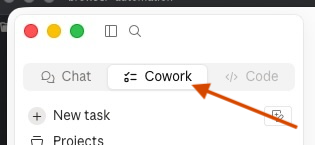
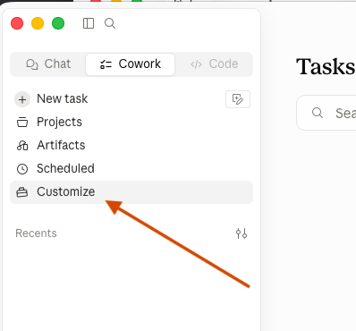
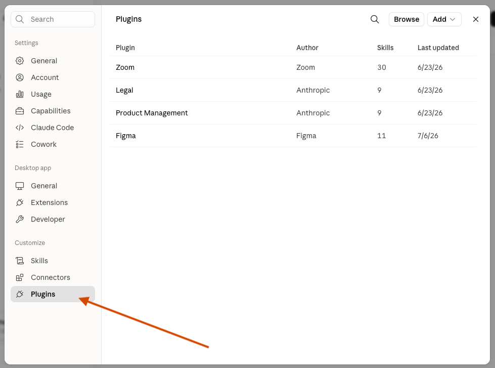
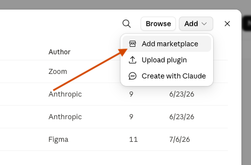
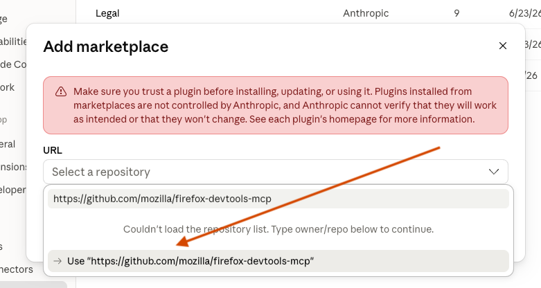
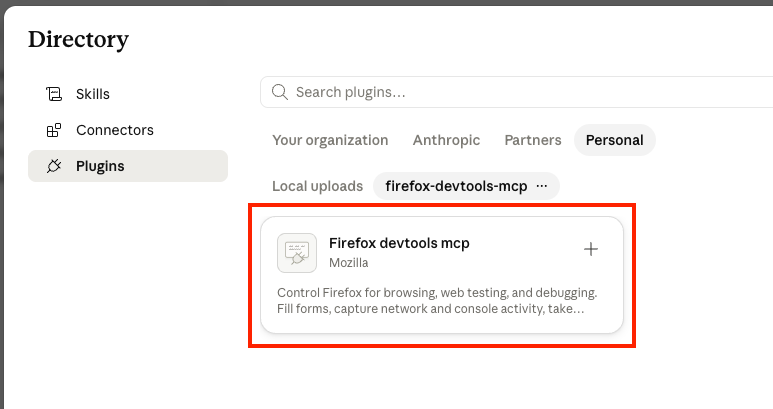
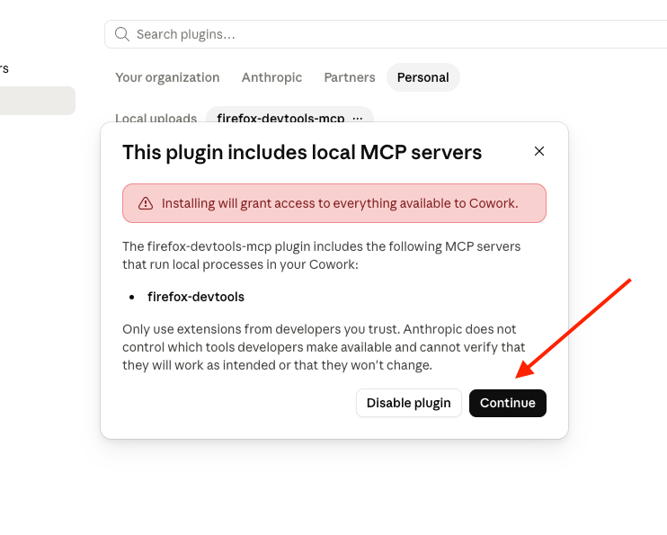
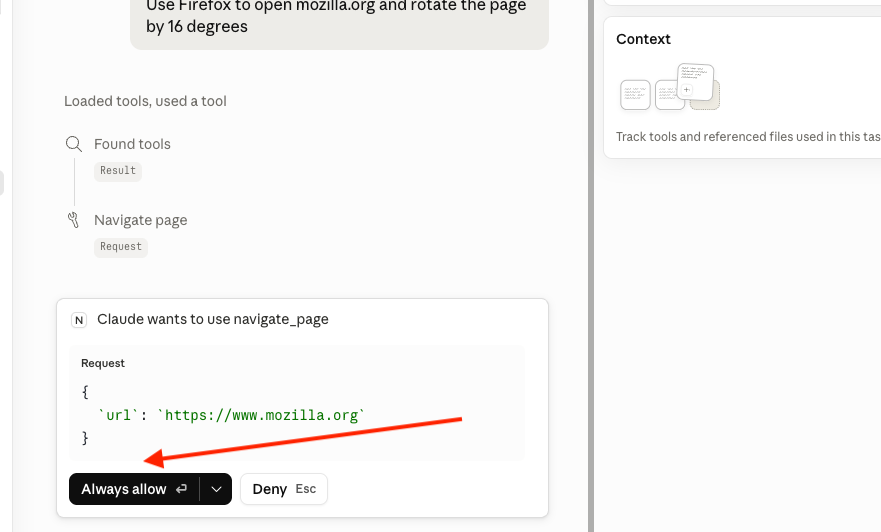

# Plugin installation for Claude Cowork

## Installation Steps

Step by step guide to install the firefox-devtools-mcp plugin to Claude Cowork.

At any point, make sure the **Cowork** tab is selected and not the **Chat** tab. Plugins only work with Cowork.

1. Open the **Claude Desktop** application, and select the **Cowork** tab.

2. In the left sidebar, click on the **Customize** button.

3. In the popup which opened, click on the **Plugins** category.

4. In the top-right, click on **Add > Add marketplace**.

5. Paste the URL of this repository (`https://github.com/mozilla/firefox-devtools-mcp`) in the popup, validate.

6. Click on **Sync**.

7. You should now see a new popup called **Directory**, with the list of plugins from the new marketplace.

8. Click on the **+** button and wait for the security prompt (it takes a few seconds), then click **Continue**.

9. Plugin is now ready to use. Close all the popups and try it out in a Cowork task such as "Use Firefox to open mozilla.org and rotate the page by 16 degrees".

10. You will have to allow each tool usage when starting a new task, so make sure to click the **Allow** button if appropriate.

## Troubleshooting

Some known issues / limitations.

**Q: Claude says it doesn't have access to Firefox or to Firefox DevTools mcp.**

Double check you are in **Claude Cowork** and not **Claude Chat**. Check that the plugin is listed after clicking on **Customize > Plugins**. If that fails, file a bug on [Bugzilla](https://bugzilla.mozilla.org/enter_bug.cgi?format=__default__&blocked=2026717&product=Developer%20Infrastructure&component=Firefox%20MCP) or ask in the [#firefox-devtools-mcp Matrix room](https://chat.mozilla.org/#/room/#firefox-devtools-mcp:mozilla.org).

**Q: Firefox closes after Claude has executed its task.**

It's a known issue, see [Bug 2052882](https://bugzilla.mozilla.org/show_bug.cgi?id=2052882). You can ask Claude to perform complex tasks in several steps but it will still stop the browser before taking your next prompt.

**Q: Firefox is not using my profile, I don't have my bookmarks, cookies, etc.**

Exposing real profiles to LLM agents is risky and by default the MCP will use temporary profiles for each session. With [Bug 2052552](https://bugzilla.mozilla.org/show_bug.cgi?id=2052552), you will be able to reuse the same profile for consecutive sessions, but it will still differ from your regular profile.

